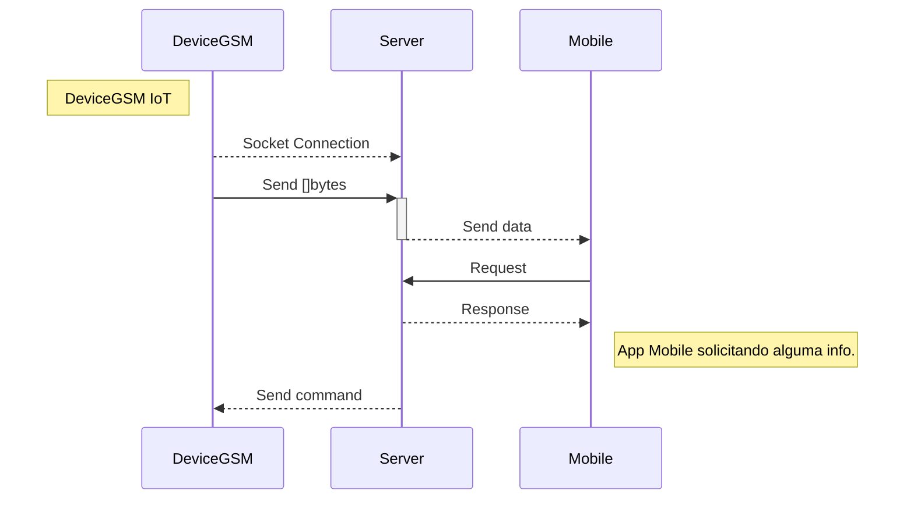

# Multi Socket's

Projeto para exemplificar alguns conceitos.

```mermaid
sequenceDiagram
participant DeviceGSM
participant Server
participant Mobile


Note left of DeviceGSM: DeviceGSM IoT
DeviceGSM-->>Server: Socket Connection
DeviceGSM->>+Server: Send []bytes
Server-->>-Mobile: Send data


Mobile->>Server: Request 
Server-->>Mobile: Response 
Note right of Mobile: App Mobile solicitando alguma info.

Server-->>DeviceGSM: Send command

```