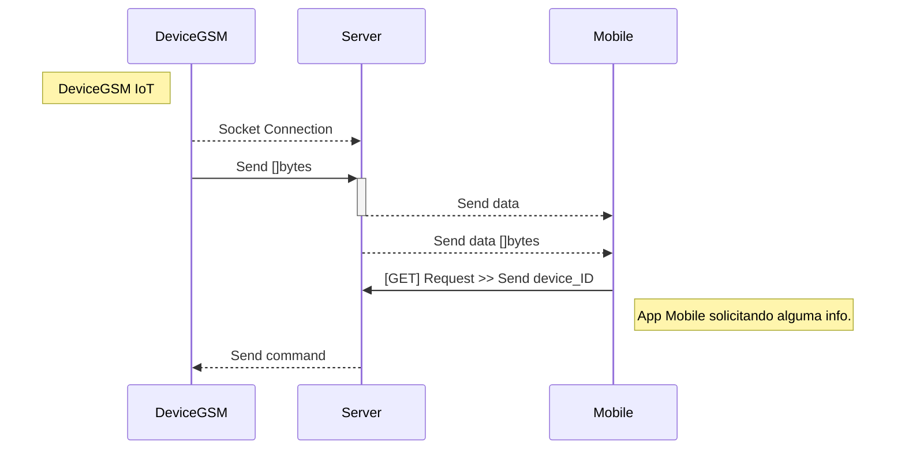
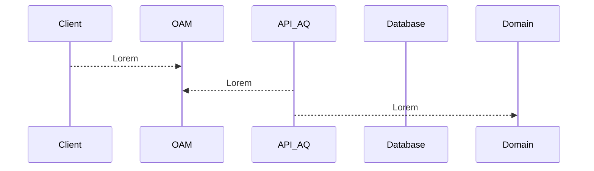

# Multi Socket's

Projeto consiste em 3 camadas, a primeira é um device/sensor que envia um hex via socket para um server. O server hoje tem a
responsabilidade de receber esse hex, converter e chamar o método. Após ter "traduzido" o hex, o server enviar o data para um App mobile.

> O app mobile tbm faz solicitações para o server pedindo a localização do device/sensor. # Ainda em dev

Código criado apenas com fins educacionais

## TODO's

- [x] Server
- [x] Client
- [x] Broadcast
- [ ] Handler para http protocol

