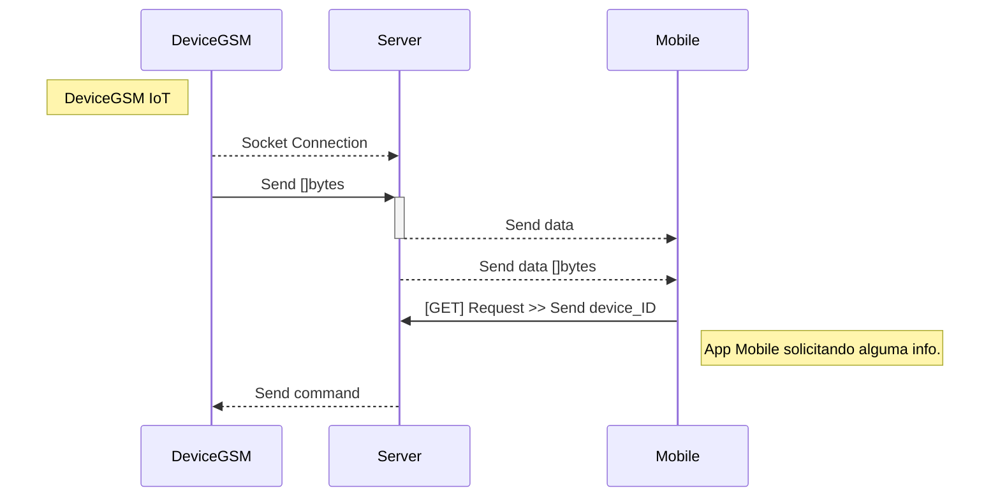

# Multi Socket's

Código criado apenas com fins educacionais

```mermaid
    sequenceDiagram
    participant DeviceGSM
    participant Server
    participant Mobile
    Note left of DeviceGSM: DeviceGSM IoT
    DeviceGSM-->>Server: Socket Connection
    DeviceGSM->>+Server: Send []bytes
    Server-->>-Mobile: Send data
    Server-->>Mobile: Send data []bytes 
    Mobile->>Server: [GET] Request >> Send device_ID 
    Note right of Mobile: App Mobile solicitando alguma info.
    Server-->>DeviceGSM: Send command
```